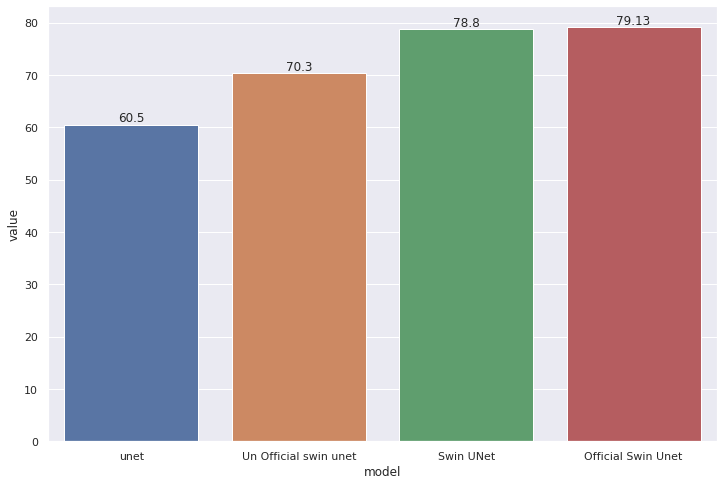

# SwinUNet-Project
This study presents a paper that concerns the utilization and the potential of Swin Transformer-based to be applied in the vision domain, in particular in the medical domain comparing the results with the various convolutional neural network (CNN). The proposed method is a novel approach known as Swin-Unet, which is a pure Transformer-based U-shaped Encoder-Decoder architecture for medical image segmentation. The method incorporates skip-connections and employs a hierarchical Swin Transformer with shifted windows as the encoder and a symmetric Swin Transformer-based decoder with a patch expanding layer for up-sampling. Experimental evaluations on multi-organ datasets that the proposed method outperforms existing methods that utilize full convolution or a combination of transformer and convolution. The codes and trained models used in this study are publicly available on GitHub https://github.com/HuCaoFighting/Swin-Unet.

